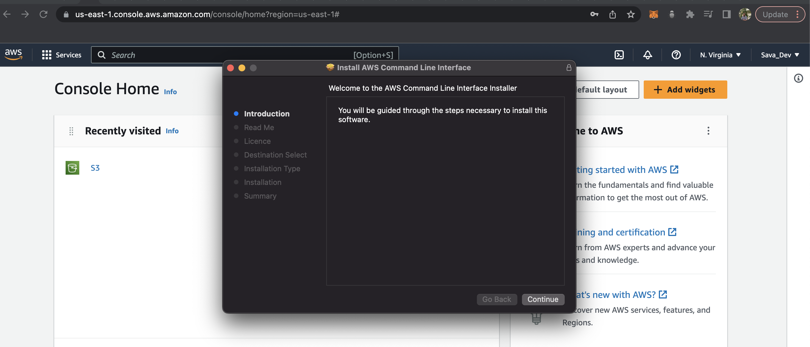

# Week 0 — Billing and Architecture

## Required Home Work
### Recreate Conceptual Diagram in Lucid Charts

### Logical Architectual Diagram in Lucid Charts

Link to the Diagram: [Lucid Charts](https://lucid.app/lucidchart/203cdb76-8e83-4cf5-8788-080b90d00c91/edit?viewport_loc=91%2C140%2C1565%2C835%2C0_0&invitationId=inv_bdd133f6-bfa7-454e-8e04-690d81672976)

## AWS CLI- Install

I installed the AWS CLI manually. i had issues installing it using the terminal.

